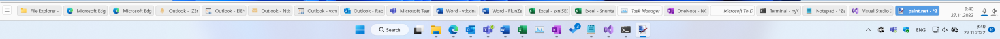
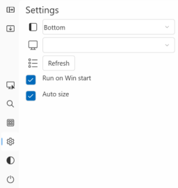

# AppSwitcherBar #

`AppSwitcherBar` is a proof-of-concept application providing the application bar complementary to Windows 11 Taskbar with ungrupped application windows buttons for easy one-click application switching.

I did not use any invasive techniques that replace the Win11 task bar as I use Win11 for my day-job and didn't want to potentially jeopardize the system stability. `AppSwitcherBar` is not a substitute for Win11 task bar, but it's a complement that can "sit on top of the taskbar" and provide the ungrouped buttons with the possibility to quickly switch between the application by single mouse click. 

*Note: It's built as NET6 WPF application, but as it heavily uses the Win32 API, it's bound to Windows OS by design (tested on Windows 11 and Windows 10).*

## Quick Start ##
To start `AppSwitcherBar`, just run `net.adamec.ui.AppSwitcherBar.exe`. This will create the application bar (window) and dock it to the edge of monitor as configured in application settings (bottom edge is the default). When there is a Windows Taskbar at the same edge, the application bar is placed "besides" towards the screen content. The application bar behaves similar way like the Taskbar - it will reduce the area for the other applications so they will not overlap even when maximized.



`AppSwitcherBar` periodically enumerates the available application windows and presents them as buttons in the bar. The current active (foreground) application window has the highlighted button. The button contains icon (if it can be retrieved) and the window title. The title can be cropped to fit the button size, the full title is available in tool-tip when hovering the mouse over the button.

Click to window button to make it active (foreground). Clicking to the button of the active application window makes such window minimized.

The windows of the "same" applications don't group into single button (well, that's why I built the app), however the `AppSwitchBar` put's the application windows belonging to the same process together (that's what "grouping" is in context of `AppSwitchBar`).
*Note: Grouping by the process handle is not 100% reliable, but so far seems to be good enough. When (if) I'll be able to properly get the Application User Model IDs from running applications/windows, I'll use it for "grouping" as the Taskbar does.*  

Hovering over the button pops up the live thumbnail of the application window.   Also the full window title is available in tool-tip when hovering the mouse over the button (the title within the button can be cropped to fit the button size).


Neither the application bar nor the window buttons auto-size yet, their size is usually configurable. The application bar can be resized using the drag&drop thumb at the inner edge (the one towards the "content" area).

Use the "X" icon to close the application and restore the content area.

The UI provides a few "on screen" (runtime) settings. Click to gear icon to toggle the settings panel.



The top dropdown allows to change the position of the application bar (dock mode).


The second dropdown allows to move the application bar to different monitor when running in multiple displays environment. The primary display is used at startup.


The collection of application windows (buttons) is periodically updated and the changes are applied incrementally to keep the order and position within the bar. The `Refresh` button forces "hard" refresh meaning the collection is cleaned and rebuilt from scratch.

## Application Settings ##
Besides the runtime configuration described above, it's possible to adjust the application settings stored in `appsettings.json` file in the application folder.

```json
{
  "AppSettings": {
    "ShowInTaskbar": true,

    "AppBarDock": "Bottom",
    "AppBarDockedWidth": 200,
    "AppBarDockedHeight": 100,
    "AppBarMinWidth": 100,
    "AppBarMinHeight": 50,

    "AppBarResizeRedrawOnDrag": true,

    "AppBarButtonWidth": 150,

    "AppBarThumbnailWidth": 200,
    "AppBarThumbnailHeight": 120,

    "RefreshWindowInfosIntervalMs": 200,

    "FeatureFlags": {
      "JumpList": false 
    } 
  },

  "Logging": {
    "LogLevel": {
      "Default": "Warning"
    },
    "Debug": {
      "LogLevel": {
        "Default": "Debug"
      }
    }
  }
}
```

- `ShowInTaskbar` - Flag whether to display the `AppSwitcherBar` in the Taskbar (it automatically excludes itself from the list of windows in the bar regardless of this setting)
- `AppBarDock` - Startup position of the application bar (Top, Left, Right, Bottom) 
- `AppBarDockedWidth` - The width of the application bar when positioned vertically
- `AppBarDockedHeight` - The height of the application bar when positioned horizontally
- `AppBarMinWidth` -  The minimal width of the application bar when positioned vertically
- `AppBarMinHeight` - The minimal height of the application bar when positioned horizontally
- `AppBarResizeRedrawOnDrag` - Flag whether to redraw (resize) the application bar when dragging the thumb. If set to `false`, the bar is only resized when the thumb is dropped
- `AppBarButtonWidth` - The width of the button representing the application window
- `AppBarThumbnailWidth` - The width of application window thumbnail
- `AppBarThumbnailHeight` - The height of application window thumbnail
- `RefreshWindowInfosIntervalMs` - The interval in milliseconds for refreshing the collection and status of the application windows 
- `FeatureFlags` - Section used to configure (and allow/block) the experimental features or work in progress.

*Note: The application uses the standard [.NET Configuration system](https://docs.microsoft.com/en-us/dotnet/core/extensions/configuration), so it's also possible to set the configuration values using the command line parameters or environment values*

*Note: The application uses the standard [.NET Logging API](https://docs.microsoft.com/en-us/dotnet/core/extensions/logging) that can be configured in the settings file as well. The default logging providers are used (Console, Debug, EventSource,EventLog)* 

## Behind the Scenes ##
This chapter provides some additional information about the implementation details, that might be useful for the developers.
 
### Application Desktop Toolbar (appbar) ###
Application desktop toolbar (appbar) is an application window that behaves similar way like the Windows Task bar. It is docked to an edge of the screen, and Windows restricts other applications from using the screen area occupied by the appbar. 

The Windows manages the appbars (yes, there can be multiple appbars present) and provides function `SHAppBarMessage` allowing an application implementing the appbar to control the appbar. Windows sends the `ABM` notifications as a payload of application defined message ID back to window. The appbar related logic is implemented in `AppBarWindow` class that extends the WFP `Window` and is used as a base for the main (WPF) application window.

The appbar is created from regular window by sending the message `ABM_NEW` providing the HWND of window and custom message ID (application specific) that is used for sending the notification messages from Windows to `WNDPROC` of appbar application. As WPF by default handles all low-level communication between application window and Windows, it requires bit more work to be done. `AppBarWindow.OnSourceInitialized` override gets the HWND of application window (to-be-appbar) utilizing the `HwndSource` helper and calls `AppBarWindow.AppBarInitialize` method to register appbar. WPF doesn't provide the direct access (override) for `WNDPROC`, but it's again possible to use `HwndSource` to hook `AppBarWindow.WndProc` into the message flow and intercept the messages toward the appbar window. 

Managing the size and position is a bit complex task. In general, Windows is responsible for proper sizing and positioning (incl. z-order) of the appbar so there has to be a kind of collaboration between the application and Windows.

To set the size and position, the application sends `ABM_QUERYPOS` message with `APPBARDATA` containing the information about the required dock mode (edge) and proposed bounding box. Windows checks whether the appbar can be placed to the proposed rectangle (it's not already occupied by Taskbar or another appbar) and returns (adjusted) rectangle back to application as the output of the `SHAppBarMessage`. This call is a kind of query "where can I place the appbar?".

The application use the data from position query to make a "real" size and position request sending the `ABM_SETPOS` message. Again, the system may adjust the rectangle before returning it to the application and the application finally uses the returned bounding box to set its size and position. 

The size and position flow is implemented in `AppBarWindow.AppBarUpdate` method as well as in `AppBarWindow.WndProc`. The `WNDPROC` is a WPF hook to Windows messaging towards the window. It blocks the window position or size change that is not part of "appbar flow" by tweaking `WM_WINDOWPOSCHANGING` messages. It also informs the Windows when the appbar receives `WM_ACTIVATE` and `WM_WINDOWPOSCHANGED` messages by sending `ABM_ACTIVATE` and `ABM_WINDOWPOSCHANGED` messages. 

The above mentioned messages pass through `AppBarWindow.WndProc` towards the low-level window managed by WPF. `WndProc` also listens for the message with application defined message ID (the one provided to Windows in `ABM_NEW`) as it's an endpoint for notification from appbar system. The notification type is sent in `wParam` and the `AppBarWindow.WndProc` handles the `ABN_POSCHANGED` notification causing the repeated size-and-position-flow (`AppBarWindow.AppBarUpdate`).
     
When is the appbar application closing, it must send the `ABM_REMOVE` message to unregister the appbar from system and free the desktop space for normal use. 

### Per-monitor DPI ###
The WPF applications are by default DPI-aware, however it's necessary to opt-in for Per-Monitor DPI awareness by adding/modifying the `app.manifest`as described [here](https://github.com/microsoft/WPF-Samples/blob/main/PerMonitorDPI/readme.md).

```xml
<application xmlns="urn:schemas-microsoft-com:asm.v3">
  <windowsSettings>
    <dpiAwareness xmlns="http://schemas.microsoft.com/SMI/2016/WindowsSettings">PerMonitorV2,PerMonitor</dpiAwareness>
    <dpiAware xmlns="http://schemas.microsoft.com/SMI/2005/WindowsSettings">true</dpiAware>
  </windowsSettings>
</application>
```
The application also overrides the `OnDpiChanged` method in `AppBarWindow` to ensure the proper size and position update when placing the appbar to monitor with different DPI setting as well to use the current DPI when working with size and position of appbar and thumbnails.

### Window buttons ###
`MainViewModel` periodically query Windows for the collection of application windows. The WPF `DispatcherTimer` is used to ensure proper thread safety and `MainViewModel.RefreshAllWindowsCollection` is called when the timer ticks.

It calls `EnumWindows` Windows API and process the result (callback). As the enum windows returns also the windows that are not to be displayed in the bar, some filtering is implemented 

```csharp
//Filter windows - only the top-level application windows except "itself" 
var wndStyle = User32.GetWindowLongA(hwnd, GWL_STYLE);
if (mainWindowHwnd != hwnd &&
   (wndStyle & NATIVE_WINDOW_STYLE_FILTER) == NATIVE_WINDOW_STYLE_FILTER && //appwindow, with border  and visible
   (wndStyle & WS_EX_TOOLWINDOW) == 0 &&
   (wndStyle & WS_CHILD) == 0)
   {...}
```
*Note: There are still edge cases where the filter don't block some windows that are not shown in Windows Task bar. I'll have to check and update the filter.*

The window title is retrieved using `GetWindowText` API and the windows with empty title are ignored. Next, the window thread and process handles are retrieved using `GetWindowThreadProcessId`. Process handle is currently used to group the "similar" windows in the application bar.

The icon retrievar is also a bit complex as there are multiple possible sources of the icon. First, `WM_GETICON` message is sent to source window. When the window doesn't provide icon via `WM_GETICON` (it's a valid case), the window class is queried for `GCLP_HICONSM` icon pointer. If not set, it tries to get `GCLP_HICON` pointer. When none of the methods provides the icon handle/pointer, no icon is shown in button but the window is kept in the collection.

`GetForegroundWindow` function is used to retrieve the current foreground window, so it can be highlighted in the appbar. There is a simple logic excluding the appbar window as it technically becomes the foreground window when switching the applications. 

### Application Windows Thumbnails ###
Windows Taskbar provides the application window live thumbnails on mouse hover. This functionality is provided by Desktop Window Manage (DWM) and `AppSwitcherBar` uses its API for the same functionality.

The window buttons content is defined in `MainWindow.xaml` and it also "attach" the customized `ThumbnailPopup` that extends the standard WFP `Popup`. Popup is "special" within WPF as it's rendered in own window besides the WPF Application window to allowing to render the popup content outside the application window area. The tricky part is that the popup itself is just a "blank" within the visual tree of button and the content of popup has a dedicated visual tree even with with own HWND although they share the same logical tree. Such behavior needs to be taken into the consideration when accessing the popup content, but it's very useful for required thumbnail functionality (implemented in `ThumbnailPopup` and in `MainViewModel`).

When a popup is open, it sends a command to view model with the information about popup HWND and available bounding box for the thumbnail. `MainViewModel.ShowThumbnail` calls Desktop Window Manager's function `DwmRegisterThumbnail` to establish the relationship between the source window and the target window (thumbnail). Next, it asks DWM for the size of the source window (thumbnail) via `DwmQueryThumbnailSourceSize`. The thumbnail is scaled and centered to fit the popup while keeping the aspect ratio and `DwmUpdateThumbnailProperties` function of DWM is called to start rendering the thumbnail into target window and given bounding box.

When the popup is closed, `DwmUnregisterThumbnail` function is called to stop rendering the thumbnail.     

## Additional Features/Ideas ##
 - Fine tune the logic for windows filtering and icon retrieval 
 - Use the Application User Model IDs for grouping the application window buttons
 - Provide the right-click menu to buttons allowing to close the window and providing the [Jump Lists](https://docs.microsoft.com/en-us/windows/win32/shell/taskbar-extensions#jump-lists)
 - Optional auto hide functionality of appbar

## Credits & Sources Used ##
 - [Taskbar Extensions documentation](https://docs.microsoft.com/en-us/windows/win32/shell/taskbar-extensions)
 - [Application Desktop Toolbars (appbars) documentation](https://docs.microsoft.com/en-us/windows/win32/shell/application-desktop-toolbars)
 - [Desktop Window Manager (DWM) thumbnail documentation](https://docs.microsoft.com/en-us/windows/win32/dwm/thumbnail-ovw)
 - A lot of Windows API is being used, so [Windows API documentation](https://docs.microsoft.com/en-us/windows/win32/apiindex/windows-api-list) comes handy as well as [PInvoke.net](https://www.pinvoke.net/)
 - Windows API Code Pack 1.1 is long time depreciated but still a good source of "how to". The original code is not available anymore, but a "mirror" can be found for example [here](https://github.com/aybe/Windows-API-Code-Pack-1.1) 
 - [MahApps.Metro IconPacks](https://github.com/MahApps/MahApps.Metro.IconPacks) are good source of icons for WPF applications
 - WPF implementation of AppBar is based on work of [Mitch Gaffigan](https://github.com/mgaffigan/WpfAppBar)