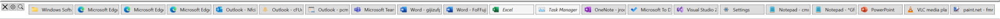
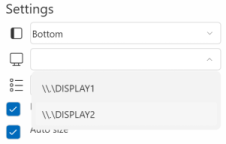

# AppSwitcherBar #

`AppSwitcherBar` provides the application bar complementary to Windows 11 Taskbar with ungrouped application windows buttons for easy one-click application switching.

I did not use any invasive techniques that replace the Win11 task bar as I use Win11 for my day-job and didn't want to potentially jeopardize the system stability. `AppSwitcherBar` is not a substitute for Win11 task bar, but it's a complement that can "sit on top of the taskbar" and provide the ungrouped buttons with the possibility to quickly switch between the application by single mouse click. 

*Note: It's built as NET6 WPF application, but as it heavily uses the Win32 API, it's bound to Windows OS by design (tested on Windows 11 and Windows 10).*

## Quick Start ##
To start `AppSwitcherBar`, just run `AppSwitcherBar.exe`. 
Main features
 - Top level **application windows** are presented as **buttons within the bar**
 - **Applications pinned to task bar** without any window open are presented as light background buttons with title in italics. **Click** on the button to launch the pinned application.
 - The buttons for windows of the same applications are displayed together but there is always a button for each top level window (this is called grouping here)
 - Optionally, it's possible to hide the applications (buttons) having only single window (use `HideSingleWindowApps` setting). When the pinned applications support is on and the application has a pin, it will be not be hiden even having a single window.
 - **Click** on the application window button **to switch to application** or to minimize the window of foreground applicaiton
 - **Hover the mouse** over the application window button **to show the live thumbnail** of the window
 - **Drag and drop** (using mouse and left button) the application window buttons **to reorder** them. You can reorder the same application windows ("within group") or the whole applications ("groups")
 - **Right click** on the application window button for the context menu with possibility to **close the window**, **start a new application instance** or **launch** the (recent) **item or task from JumpList**.
 - Toggle the **settings panel** using the **`Gear` icon**.
   - **Set the docking edge** (top, bottom, left, right)
   - **Choose the monitor** where to display the `AppSwitcherBar`
   - Enable/disable bar and application window button **auto-size**
   - Enable/disable **starting** the `AppSwitcherBar` **on Windows start**
 - **Close the `AppSwitcherBar`** using the **`X` icon**.


 ## Features ##
`AppSwitcherBar` will create the application bar (window) and dock it to the edge of monitor as configured in application settings (bottom edge is the default). When there is a Windows Taskbar at the same edge, the application bar is placed "besides" towards the screen content. The application bar behaves similar way like the Taskbar - it will reduce the area for the other applications so they will not overlap even when maximized.


As mentioned above, the idea is not to use any invasive techniques. It's possible to get a good result when combining the `AppSwitcherBar` with auto-hide functionality of standard Windows Taskbar. In such case the `AppSwitcherBar` seems to be "main bar", although it's possible to simply get the Windows Taskbar by moving the mouse "over the outer edge".



`AppSwitcherBar` periodically enumerates the available application windows and presents them as buttons in the bar. The current active (foreground) application window has the highlighted button. The button contains icon (if it can be retrieved) and the window title. The title can be cropped to fit the button size, the full title is available in tool-tip when hovering the mouse over the button.

Click to window button to make it active (foreground). Clicking to the button of the active application window makes such window minimized.

The windows of the "same" applications don't group into single button (well, that's why I built the app), however the `AppSwitchBar` puts the application windows belonging to the same process together (that's what "grouping" is in context of `AppSwitchBar`).

Hovering over the button pops up the live thumbnail of the application window. Also the full window title is available in tool-tip when hovering the mouse over the button (the title within the button can be cropped to fit the button size).


`AppSwitcherBar` shows the also the buttons of the applications pinned to the task bar as light buttons ("pins") when there is no window open for the application. The pin button doesn't have the thumbnail and click to the button launches the application.
*Note: The functionality uses undocumented Windows interface `IPinnedList3`, so it might not be stable. Use the setting `ShowPinnedApps` to switch it off in case of issues.*


Application window or pin buttons can be reordered using mouse drag and drop. Drag the source button and drop it to the target button. When dragging over the buttons, the cursor will signal where the source will be placed if droped here. When dragging to the left/top, the source will be placed before the target. When dragging to right/bottom, the source will be placed after the target.
When the source and target window buttons belongs to the same application, only the single window button will be moved to the new position ("within the group"). The source button is in light blue color, the target in dark gray.


When the source and target window buttons belongs to different applications, all (source) application window buttons will be moved to the new position. The source group is in light blue color, the target one in dark gray.


Right mouse button click on the button representing a window, opens the context menu allowing to start a new instance of application or close the window. `Cancel` menu item just closes the menu without any action or you can simply click anywhere outside the menu.


When the `JumpList` feature flag is set (true by default) and the application provides JumpList, its items are also added to the context menu and can be used to launch the documents or tasks as defined by the application.


Use the "X" icon to close the application and restore the content area.

The UI provides a few "on screen" (runtime) settings. Click to gear icon to toggle the settings panel.


The top dropdown allows to change the position of the application bar (dock mode).


The second dropdown allows to move the application bar to different monitor when running in multiple displays environment. The primary display is used at startup.



The collection of application windows (buttons) is periodically updated and the changes are applied incrementally to keep the order and position within the bar. Besides the data that can be directly retrieved during the window enumeration, `AppSwitcherBar` also use some "global" helper data about applications installed and available for current user within the system. Installed applications data are used for filling some gaps when the proper information is not retrieved directly from application window, for example icon for Windows Store apps. Installed applications data are also important to get the right Application User Model ID (used for example for grouping or JumpLists) as only a few windows or processes provide it directly. Retrieving installed application data is an operation that typically takes a few seconds, so these helper data are being retrieved on background at startup. The main `AppSwitcherBar` functionality is available during the background data retrieval, user is just notified by "Arrow with CD" cursor when hovering over the buttons, that the retrieval is still in progress.

The `Refresh` button in configuration panel forces "hard" refresh of data. The collection of application windows and pinned applications (buttons) are cleaned and rebuilt from scratch and the background data are reloaded.

It's possible to add `AppSwitcherBar` to Windows Startup folder using the checkbox `Run on Win start`. This functionality can be disabled by settings (see the next chapter).

When the auto-size is off, the buttons use the fixed size as defined in settings (`AppBarButtonWidth`, `AppBarButtonHeight`) and bar width/height is to be adjusted manually using the drag and drop thumb at the outer edge.
When the auto-size switch is on, the `AppSwitcherBar` auto-size itself as well as the application window buttons. Buttons use the fixed height as defined in settings (`AppBarButtonHeight`), the width can vary - buttons can be make smaller up to ratio defined in settings (`AppBarButtonMinWidthRatio`) - default value is 50%.
 - For vertical bar with single column, the full button size is used, when the bar has multiple columns, the minimal button width is used.
 - Horizontal bar tries to accommodate as much buttons as possible in each row adjusting the size of buttons between the minimal and full width to fill the row.

User settings are persisted to `appsettings.user.json` file in the application folder. The file contains the setting for dock position (edge), docked width and height and auto-size on/off switch. These values are used on the application start to keep the last used configuration.  

Note: To reset the user settings, simply delete the file (make sure you delete the *appsettings.**user**.json* settings file, not the *appsettings.json* containing the full application settings).

## Application Settings ##
Besides the runtime configuration described above, it's possible to adjust the application settings stored in `appsettings.json` file in the application folder.

```json
{
  "AppSettings": {
    "ShowInTaskbar": true,
    "AllowRunOnWindowsStartup": true,

    "AppBarDock": "Bottom",
    "AppBarAutoSize": true,
    "AppBarDockedWidth": 160,
    "AppBarDockedHeight": 50,
    "AppBarMinWidth": 160,
    "AppBarMinHeight": 50,

    "AppBarResizeRedrawOnDrag": true,

    "AppBarButtonWidth": 150,
    "AppBarButtonMinWidthRatio": 0.5,
    "AppBarButtonHeight": 26,
    "AppBarButtonMargin": 2,

    "AllowAppBarButtonReorder": true,
    "ShowPinnedApps": true,
    "HideSingleWindowApps": false,

    "AppBarThumbnailWidth": 200,
    "AppBarThumbnailHeight": 120,

    "RefreshWindowInfosIntervalMs": 200,
    "CheckForIconChange": true,
    "CheckForAppIdChange": false,

    "InvertWhiteIcons": true,

    "JumpListCategoryLimit": 10,
    "JumpListUseTempFiles": false,

    "FeatureFlags": {
      "JumpList": true,
      "RunOnWindowsStartup": true,
      "AnonymizeWindows": true,
      "UseApplicationResolver": true
    },

    "AppIds": {
      "%windir%/explorer.exe": "Microsoft.Windows.Explorer",
      "%LOCALAPPDATA%\\Microsoft\\Teams\\current\\Teams.exe": "com.squirrel.Teams.Teams",
      "%LOCALAPPDATA%\\Microsoft\\WindowsApps\\Microsoft.WindowsTerminal_8wekyb3d8bbwe\\wt.exe": "Microsoft.WindowsTerminal_8wekyb3d8bbwe!App"
    } 
  },

  "Logging": {
    "LogLevel": {
      "Default": "Warning"
    },
    "Debug": {
      "LogLevel": {
        "Default": "Debug"
      }
    }
  }
}
```

- `ShowInTaskbar` - Flag whether to display the `AppSwitcherBar` in the Taskbar (it automatically excludes itself from the list of windows in the bar regardless of this setting)
- `AllowRunOnWindowsStartup` - Flag whether to give use the configuration option to set `AppSwitcherBar` to run on Windows startup
- `AppBarDock` - Startup position of the application bar (Top, Left, Right, Bottom)
- `AppBarAutoSize` - Allow or block the auto-sizing the application bar and window buttons 
- `AppBarDockedWidth` - The width of the application bar when positioned vertically
- `AppBarDockedHeight` - The height of the application bar when positioned horizontally
- `AppBarMinWidth` -  The minimal width of the application bar when positioned vertically
- `AppBarMinHeight` - The minimal height of the application bar when positioned horizontally
- `AppBarResizeRedrawOnDrag` - Flag whether to redraw (resize) the application bar when dragging the thumb. If set to `false`, the bar is only resized when the thumb is dropped
- `AppBarButtonWidth` - The full width of the button representing the application window
- `AppBarButtonMinWidthRatio` - The ratio specifying the minimal button width when autosized. For example `0.6` means that button can be made smaller up to 60% of full width (`AppBarButtonWidth`)
- `AppBarButtonHeight` - The height of the button representing the application window
- `AppBarButtonMargin` - The margin to be added to window buttons as a spacer between them
- `AllowAppBarButtonReorder` - Flag whether to allow button drag and drop reorder
- `ShowPinnedApps` - Flag whether to show buttons ("pins") for applications pinned to taskbar when there is no window for pinned application
- `HideSingleWindowApps` - Flag whether to hide the applications (buttons) having only single window. When the pinned applications support is on and the application has a pin, it will be not be hiden even having a single window.
- `AppBarThumbnailWidth` - The width of application window thumbnail
- `AppBarThumbnailHeight` - The height of application window thumbnail
- `RefreshWindowInfosIntervalMs` - The interval in milliseconds for refreshing the collection and status of the application windows 
- `CheckForIconChange` - Flag whether `AppSwitcherBar` periodically checks windows for an icon change or whether the icon retrieved for the first time is used. Switching it of can give some performance gain, however some applications change their icon during their runtime to signal user some state information.
- `CheckForAppIdChange` - Flag whether `AppSwitcherBar` periodically checks windows for change of their Application ID that has an impact to grouping the buttons together. It's off by default as the runtime changes of Application ID are quite rare.
- `InvertWhiteIcons` - `AppSwitcherBar` uses light WPF theme. When the host Windows are set to dark theme, some icons provided by applications are in shadows of white (different opacity to be exact) that might be hard to see on the light background. When this option is on, `AppSwitcherBar` tries to identify "all white" icons and invert the to black for better visual experience.
- `JumpListCategoryLimit` - The maximum number of items in individual JumpList categories except `Tasks`.
- `JumpListUseTempFiles` - Flag whether to extract the links (.lnk) from JumpLists to temporary files and read properties from them. Otherwise the in-memory processing is used.
- `FeatureFlags` - Section used to configure (and allow/block) the experimental features or work in progress.
  - `JumpList` - Enable/Disable JumpList functionality.
  - `RunOnWindowsStartup` - Enable/Disable functionality manipulating the Windows startup link for `AppSwitcherBar`. Use `AllowRunOnWindowsStartup` setting to hide the configuration option, use the feature flag to use the dummy implementation. This is probably gonna be used during the development only
  - `AnonymizeWindows` - Enable/Disable anonymization of window captions in buttons. This used when making the app screen shots 
  - `UseApplicationResolver` - Enable/Disable using the undocumented win32 api to get the AppId
- `AppIds` - AppIds or Application IDs are used for grouping the buttons together, but they are also used to identify the application within the system and use the information from list of installed applications to get some additional data (for example application icon) or to decide how to launch the application (desktop and Store applications are launched different way). Unfortunately, there is no simple and straight way how to obtain the AppId, so some "try and see" logic is used. For some cases it's just easier to define the AppIds for particular application directly in the configuration. `Explorer` should always be there as defined above.

*Note: The application uses the standard [.NET Configuration system](https://docs.microsoft.com/en-us/dotnet/core/extensions/configuration), so it's also possible to set the configuration values using the command line parameters or environment values*

*Note: The application uses the standard [.NET Logging API](https://docs.microsoft.com/en-us/dotnet/core/extensions/logging) that can be configured in the settings file as well. The default logging providers are used (Console, Debug, EventSource,EventLog)* 

## Behind the Scenes ##
This chapter provides some additional information about the implementation details, that might be useful for the developers.
 
### Application Desktop Toolbar (appbar) ###
Application desktop toolbar (appbar) is an application window that behaves similar way like the Windows Task bar. It is docked to an edge of the screen, and Windows restricts other applications from using the screen area occupied by the appbar. 

The Windows manages the appbars (yes, there can be multiple appbars present) and provides function `SHAppBarMessage` allowing an application implementing the appbar to control the appbar. Windows sends the `ABM` notifications as a payload of application defined message ID back to window. The appbar related logic is implemented in `AppBarWindow` class that extends the WFP `Window` and is used as a base for the main (WPF) application window.

The appbar is created from regular window by sending the message `ABM_NEW` providing the HWND of window and custom message ID (application specific) that is used for sending the notification messages from Windows to `WNDPROC` of appbar application. As WPF by default handles all low-level communication between application window and Windows, it requires bit more work to be done. `AppBarWindow.OnSourceInitialized` override gets the HWND of application window (to-be-appbar) utilizing the `HwndSource` helper and calls `AppBarWindow.AppBarInitialize` method to register appbar. WPF doesn't provide the direct access (override) for `WNDPROC`, but it's again possible to use `HwndSource` to hook `AppBarWindow.WndProc` into the message flow and intercept the messages toward the appbar window. 

Managing the size and position is a bit complex task. In general, Windows is responsible for proper sizing and positioning (incl. z-order) of the appbar so there has to be a kind of collaboration between the application and Windows.

To set the size and position, the application sends `ABM_QUERYPOS` message with `APPBARDATA` containing the information about the required dock mode (edge) and proposed bounding box. Windows checks whether the appbar can be placed to the proposed rectangle (it's not already occupied by Taskbar or another appbar) and returns (adjusted) rectangle back to application as the output of the `SHAppBarMessage`. This call is a kind of query "where can I place the appbar?".

The application use the data from position query to make a "real" size and position request sending the `ABM_SETPOS` message. Again, the system may adjust the rectangle before returning it to the application and the application finally uses the returned bounding box to set its size and position. 

The size and position flow is implemented in `AppBarWindow.AppBarUpdate` method as well as in `AppBarWindow.WndProc`. The `WNDPROC` is a WPF hook to Windows messaging towards the window. It blocks the window position or size change that is not part of "appbar flow" by tweaking `WM_WINDOWPOSCHANGING` messages. It also informs the Windows when the appbar receives `WM_ACTIVATE` and `WM_WINDOWPOSCHANGED` messages by sending `ABM_ACTIVATE` and `ABM_WINDOWPOSCHANGED` messages. 

The above mentioned messages pass through `AppBarWindow.WndProc` towards the low-level window managed by WPF. `WndProc` also listens for the message with application defined message ID (the one provided to Windows in `ABM_NEW`) as it's an endpoint for notification from appbar system. The notification type is sent in `wParam` and the `AppBarWindow.WndProc` handles the `ABN_POSCHANGED` notification causing the repeated size-and-position-flow (`AppBarWindow.AppBarUpdate`).
     
When is the appbar application closing, it must send the `ABM_REMOVE` message to unregister the appbar from system and free the desktop space for normal use. 

### Per-monitor DPI ###
The WPF applications are by default DPI-aware, however it's necessary to opt-in for Per-Monitor DPI awareness by adding/modifying the `app.manifest`as described [here](https://github.com/microsoft/WPF-Samples/blob/main/PerMonitorDPI/readme.md).

```xml
<application xmlns="urn:schemas-microsoft-com:asm.v3">
  <windowsSettings>
    <dpiAwareness xmlns="http://schemas.microsoft.com/SMI/2016/WindowsSettings">PerMonitorV2,PerMonitor</dpiAwareness>
    <dpiAware xmlns="http://schemas.microsoft.com/SMI/2005/WindowsSettings">true</dpiAware>
  </windowsSettings>
</application>
```
The application also overrides the `OnDpiChanged` method in `AppBarWindow` to ensure the proper size and position update when placing the appbar to monitor with different DPI setting as well to use the current DPI when working with size and position of appbar and thumbnails.

### Window buttons ###
`MainViewModel` periodically query Windows for the collection of application windows. The WPF `DispatcherTimer` is used to ensure proper thread safety and `MainViewModel.RefreshAllWindowsCollection` is called when the timer ticks.

It calls `EnumWindows` Windows API and process the result (callback). As the enum windows returns also the windows that are not to be displayed in the bar, some filtering is implemented 

```csharp
//Filter windows - only the top-level application windows except "itself" 
var isCloaked = (DwmApi.DwmGetWindowAttribute(hwnd, DWMWA_CLOAKED, out var isCloakedAttribute, sizeof(bool)) == S_OK) && isCloakedAttribute;

var wndStyle = (ulong)User32.GetWindowLongPtr(hwnd, GWL_STYLE).ToInt64();
var wndStyleEx = (ulong)User32.GetWindowLongPtr(hwnd, GWL_EXSTYLE).ToInt64();

var isVisible = applicationHwnd != hwnd &&
     User32.IsWindowVisible(hwnd) &&
     (wndStyleEx & WS_EX_TOOLWINDOW) == 0 &&
     (wndStyle & WS_CHILD) == 0 &&
     (wndStyle & WS_CAPTION) == WS_CAPTION &&
     !isCloaked &&
     (
        (wndStyle & WS_EX_APPWINDOW) == WS_EX_APPWINDOW || User32.GetWindow(hwnd, GW_OWNER) == IntPtr.Zero
     );
  
```

The window title is retrieved using `GetWindowText` API and the windows with empty title are ignored. Next, the window thread and process handles are retrieved using `GetWindowThreadProcessId`. Process handle is currently used to group the "similar" windows in the application bar.

The icon retrieval is also a bit complex as there are multiple possible sources of the icon. First, `WM_GETICON` message is sent to source window. When the window doesn't provide icon via `WM_GETICON` (it's a valid case), the window class is queried for `GCLP_HICONSM` icon pointer. If not set, it tries to get `GCLP_HICON` pointer. When none of the methods provides the icon handle/pointer, no icon is shown in button but the window is kept in the collection.

`GetForegroundWindow` function is used to retrieve the current foreground window, so it can be highlighted in the appbar. There is a simple logic excluding the appbar window as it technically becomes the foreground window when switching the applications. 

### Application Windows Thumbnails ###
Windows Taskbar provides the application window live thumbnails on mouse hover. This functionality is provided by Desktop Window Manage (DWM) and `AppSwitcherBar` uses its API for the same functionality.

The window buttons content is defined in `MainWindow.xaml` and it also "attach" the customized `ThumbnailPopup` that extends the standard WFP `Popup`. Popup is "special" within WPF as it's rendered in own window besides the WPF Application window to allowing to render the popup content outside the application window area. The tricky part is that the popup itself is just a "blank" within the visual tree of button and the content of popup has a dedicated visual tree even with with own HWND although they share the same logical tree. Such behavior needs to be taken into the consideration when accessing the popup content, but it's very useful for required thumbnail functionality (implemented in `ThumbnailPopup` and in `MainViewModel`).

When a popup is open, it sends a command to view model with the information about popup HWND and available bounding box for the thumbnail. `MainViewModel.ShowThumbnail` calls Desktop Window Manager's function `DwmRegisterThumbnail` to establish the relationship between the source window and the target window (thumbnail). Next, it asks DWM for the size of the source window (thumbnail) via `DwmQueryThumbnailSourceSize`. The thumbnail is scaled and centered to fit the popup while keeping the aspect ratio and `DwmUpdateThumbnailProperties` function of DWM is called to start rendering the thumbnail into target window and given bounding box.

When the popup is closed, `DwmUnregisterThumbnail` function is called to stop rendering the thumbnail. 

### Application User Model ID ###
Application User Model ID (aka AUMID, AppId or Application ID) is an identifier used by Windows for grouping the buttons in taskbar. It's also key identifier of the modern applications (UWP/Windows Store apps). `AppSwitcherBar` also use AppId for grouping as well as for other functionality like launching the applications from context menu, or retrieving the JumpLists.
Modern applications use the AppIds like `Microsoft.WindowsCalculator_8wekyb3d8bbwe!App` and it serves as the identifier or application (package). Classic desktop application sometimes provide explicit custom AppId like `Microsoft.Office.EXCEL.EXE.15`, `Chrome` or `com.squirrel.Postman.Postman` however the path to the executable is used as AppId for the most of them. To keep it a bit more complicated, the path part corresponding to known system folder (for example Program Files) can be represented by [GUID of known folder](https://docs.microsoft.com/en-us/windows/win32/shell/knownfolderid) like `{6D809377-6AF0-444B-8957-A3773F02200E}\Altova\UModel2021\UModel.exe`. For some applications, the auto generated AppId is used, although it seems its value is somehow stable across Windows installations - for example `Microsoft.AutoGenerated.{BB044BFD-25B7-2FAA-22A8-6371A93E0456}` for EventViewer. Microsoft provides some general [guidance how to find the AppId](https://docs.microsoft.com/en-us/windows/configuration/find-the-application-user-model-id-of-an-installed-app).

   
A few applications publish the AppId at the window level. It can be retrieved from window Property Store as a property with `PKEY_AppUserModel_ID` key. For some modern applications, the AppId can be retrieved at process level using kernel's API `GetApplicationUserModelId`, but for the most applications, `AppSwitcherBar` gets the AppId using the help of installed applications list. It enumerates the shell items in `AppsFolder` on startup (at background) and tries to get the AppId from shell item Property Store (`PKEY_AppUserModel_ID`). The information is stored in `InstalledApplications` collection together with the application executable path. When `AppSwitcherBar` needs to get AppId for application window and it's not provided explicitly for window or process, it get's the application executable (using `Kernel32.QueryFullProcessImageName`) and tries to map is to installed application information. The application executable itself is used as fallback value for AppId. When needed or for some special cases, the AppIds can be provided in `AppSwitcherBar` configuration.

### Context Menus and JumpLists ###
AppId described above is a key information needed for proper functionality of context menu application launch and JumpLists.

The classic desktop application can be simply launched from code using ` Process.Start(wnd.Executable);`, however it's more complicated to launch UWP/Store applications. I use the native/COM `ApplicationActivationManager : IApplicationActivationManager` to launch the modern application using its AppId.

JumpLists in general represent a list of recent/frequent destinations and common tasks associated with an application, and are available in the context menu of application taskbar button. The content of JumpLists is stored in `AutomaticDestinations` and/or `CustomDestinations` subfolders of user's `Recent` folder. Files are named like `ff99ba2fb2e34b73.customDestinations-ms` or `5d696d521de238c3.automaticDestinations-ms`. The name of file is `Crc64` hash of AppId (that can be path to executable in some cases or application defined string as described above). The CRC hash function has a few specifics and is implemented in class `AppIdCrc64`. This is the way, how to get the JumpList files for an application:

```csharp
var b = Encoding.Unicode.GetBytes(appId.ToUpper());
var hash = AppIdCrc64.Compute(b);
var hashStr = hash.ToString("X").ToLowerInvariant();
var recentDir = Environment.GetFolderPath(Environment.SpecialFolder.Recent);
var customDestinationsFile = Path.Combine(recentDir, "CustomDestinations", $"{hashStr}.customDestinations-ms");
var automaticDestinationsFile = Path.Combine(recentDir, "AutomaticDestinations", $"{hashStr}.automaticDestinations-ms");
var customDestinationsFileExists = File.Exists(customDestinationsFile);
var automaticDestinationsFileExists = File.Exists(automaticDestinationsFile);
```

The automatic destinations are stored in Compound File implementation of [Structured Storage](https://docs.microsoft.com/en-us/windows/win32/stg/structured-storage-start-page) that is widely used in COM/OLE programming. .NET provides some support of Compound Files in `System.IO.Packaging.StorageInfo`, although the access to the root storage (let's say the "entry point to file") is "hidden" in `System.IO.Packaging.StorageRoot` .NET internal class, but can still be used with a dirty reflection magic. The storage contains set of streams. One, called `DestList`, contains details about the items and so far is not that much interesting unless we want to access the information whether an item is pinned. I do ignore the stream as I didn't get reliable understanding of the format that is not documented.
The other streams with numbered names represent individual items that are simply serialized shortcuts (link, `.lnk`) files.

The custom destinations are stored in files containing the information about categories (recent/frequent, tasks, custom,...) and containing items. Although the file format is not documented, it was quite easy to understand (see `JumpListService.ParseCustomDestinations` method for details) and it will also provide the serialized link files.

As the custom destinations contains links serialized as OLE Streams, it can be simply read either using `Ole32.OleLoadFromStream` into the COM object implementing `IShellLinkW`. Automatic destinations serialize the links just as binaries into the Compound file, so I did a small trick to be able to reuse the functionality - a binary buffer is created containing the CLSID of `IShellLinkW` and then the content of link file itself. That's the way how OLE streams are often stored, so I can again use `OleLoadFromStream`.

Once the `IShellLink` object is available, the basic information about the link can be retrieved using the methods of the interface.
When the setting `JumpListUseTempFiles` is set, `IPersistFile` interface of link is used to temporary store the link to file and read it as `IShellItem2` to get the access to shell properties providing the additional information about link that are used by `AppSwitcherBar`.
When the setting `JumpListUseTempFiles` is not set, `IPropertyStore` interface of link is used to process the link in-memory.
*Note: Although both methods should be identical, there are slight differences - for example in-memory processing provides thumbnails of images in icons as the icons are retrieved from link target. And it seems also a bit faster.*

### Taskbar Pinned Applications ###
Getting the information about applications pinned to taskbar seems to be a bit tricky. The simplest way is to get the links (`.lnk`) from `AppData\Roaming\Microsoft\Internet Explorer\Quick Launch\User Pinned\TaskBar`. Trying this method, I struggled with getting the order of pins. The list of pinned applications is also stored in registry value `HKCU\Software\Microsoft\Windows\CurrentVersion\Explorer\Taskband\Favorites` - a binary value without documented format. As the information in registry value is apparently in the right order, I tried to find the name of the link file and then sorted the links (retrieved from the directory mentioned above) by the position of name within the binary registry value. 
Unfortunatelly, this method doesn't work well for Store/UWP applications. In such case, there is no `.lnk` file created in quick launch folder, but the registry value I used to get the order of links, contains the information about the UWP applications. I tried to somehow extract the AppIds of the pinned Store apps together with the information about order of pins, but it I didn't find a reliable way but to do very slow one by one check against the list of installed applications. So I gave up using this method.

I found in interesting [article](https://geelaw.blog/entries/msedge-pins/) by Gee Law elaborating the native interface `IPinnedList3` and related COM class. As the interface is not documented and there are almost no other sources of information at the internet, I had to play&fail a bit, but finally made it work as needed.

Simplified algorithm follows, the real implementation is in `JumpListService.GetPinnedApplications`.

```csharp
//get the COM class type for {90aa3a4e-1cba-4233-b8bb-535773d48449}
var objType = Type.GetTypeFromCLSID(new Guid(Win32Consts.CLSID_TaskbanPin), false);
//create an instance of COM class
var obj = Activator.CreateInstance(objType);
//get the IPinnedList3 interface
var pinnedList=obj as IPinnedList3;
//get the enumerator
var hrs = pinnedList.EnumObjects(out var iel);
do
{
   hrs = iel.Next(1, out var pidl, out _);
   if (!hrs.IsS_OK) break;

   hrs = Shell32.SHCreateItemFromIDList(pidl, iShellItem2Guid, out var shellItem);
   if (!hrs.IsS_OK || shellItem == null) break;

   //get the information from shell item representing either 
   //link to desktop app or directly Store/UWP app
   ...

   Marshal.FreeCoTaskMem(pidl);
} while (hrs.IsS_OK);
```

As mentioned above, the interface is not public and documented (and it's versioned as well), so it can change with some Windows update. Use the setting `ShowPinnedApps` to switch the functionality off in case of issues.

## Additional (future) Feature Ideas ##
  - Optional auto hide functionality of appbar
  - Search and switch to application by title (from enumerated windows)
  - Search and launch application by name (from installed applications)
  - Support for system light and dark schemes

## Credits & Sources Used ##
 - [Taskbar Extensions documentation](https://docs.microsoft.com/en-us/windows/win32/shell/taskbar-extensions)
 - [Application Desktop Toolbars (appbars) documentation](https://docs.microsoft.com/en-us/windows/win32/shell/application-desktop-toolbars)
 - [Desktop Window Manager (DWM) thumbnail documentation](https://docs.microsoft.com/en-us/windows/win32/dwm/thumbnail-ovw)
 - A lot of Windows API is being used, so [Windows API documentation](https://docs.microsoft.com/en-us/windows/win32/apiindex/windows-api-list) comes handy as well as
   - [PInvoke.net](https://www.pinvoke.net/) 
   - [James Forshaw's OleViewDotNet](https://github.com/tyranid/oleviewdotnet)
   - [Geoff Chappell's Win API analysis](https://www.geoffchappell.com/index.htm)
 - Windows API Code Pack 1.1 is long time depreciated but still a good source of "how to". The original code is not available anymore, but a "mirror" can be found for example [here](https://github.com/aybe/Windows-API-Code-Pack-1.1) 
 - [MahApps.Metro IconPacks](https://github.com/MahApps/MahApps.Metro.IconPacks) are good source of icons for WPF applications
 - WPF implementation of AppBar is based on work of [Mitch Gaffigan](https://github.com/mgaffigan/WpfAppBar)
